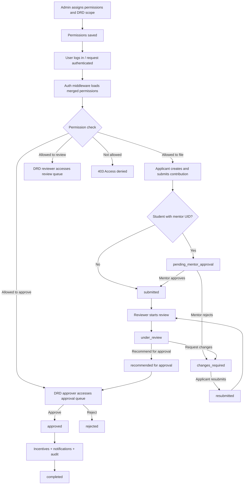

# Research Module Tester Manual

## Purpose

This document is a tester-focused user manual for the Research module in UMS. It explains:

- who can perform each action
- how permissions affect visibility and access
- the end-to-end submission, mentor, review, and approval workflow
- what statuses are expected at each step
- what testers should validate

This manual is intended for QA, UAT, and business-side testing of the Research contribution workflow.

---

## Module Scope

This manual covers the research contribution workflow implemented through the Research module.

Main areas covered:

- research contribution creation
- submission for review
- mentor approval flow for student applicants
- DRD reviewer workflow
- DRD final approval workflow
- permission-controlled access
- status transitions
- notifications, audit, and completion behavior

---

## User Roles In Scope

The following user types are relevant for testing:

1. Applicant
2. Mentor
3. DRD Reviewer
4. DRD Approver / DRD Head
5. Admin

### 1. Applicant

The applicant creates and submits a research contribution.

Typical applicant types:

- faculty
- student
- staff with explicit filing permission
- admin with explicit filing permission

### 2. Mentor

The mentor is only involved when a student submission includes a valid mentor UID.

The mentor can:

- approve the submission and forward it to DRD
- reject it back for changes

### 3. DRD Reviewer

The DRD reviewer performs the first formal review step.

The reviewer can:

- open pending review items
- start review
- request changes
- recommend for approval

### 4. DRD Approver / DRD Head

The DRD approver performs the final decision step.

The approver can:

- view eligible items in the review queue
- approve a contribution
- reject a contribution
- mark an approved contribution as completed

### 5. Admin

The admin manages permission assignment and reviewer scope.

The admin can:

- assign school department permissions
- assign central department permissions
- assign DRD-related permissions
- assign scope such as school/category access

---

## Permission Model

The Research module depends on the permission system before workflow actions can happen.

Permissions are assigned by Admin through Permission Management and then loaded into the authenticated user context during requests.

### Permission Sources

Permissions may come from:

- school department permission assignment
- central department permission assignment
- role-based permissions if configured

For the Research module, DRD review and approval are mainly controlled through central department permissions.

### Core Research Permissions

#### `research_file_new`

Purpose:
- allows filing of new research contributions

Behavior:
- faculty and student users can file by default
- staff and admin require this explicit permission

#### `research_review`

Purpose:
- allows DRD reviewer actions

Behavior:
- user can access review queue
- user can start review
- user can request changes
- user can recommend for approval

#### `research_approve`

Purpose:
- allows final DRD approval actions

Behavior:
- user can approve
- user can reject
- user can mark approved records as completed
- user can access workflow health endpoint

#### `research_assign_school`

Purpose:
- allows assignment of school scope to DRD members for research review operations

Behavior:
- used in administrative configuration
- impacts which records a DRD reviewer can see

---

## Permission and Access Summary

| User Type | Can Create Draft | Can Submit | Can Review | Can Approve | Notes |
| --- | --- | --- | --- | --- | --- |
| Faculty | Yes | Yes | No | No | filing allowed by default |
| Student | Yes | Yes | No | No | may enter mentor flow |
| Staff | Yes, if `research_file_new` | Yes, if `research_file_new` | No, unless `research_review` | No, unless `research_approve` | explicit permission required |
| Admin | Yes, if `research_file_new` | Yes, if `research_file_new` | No, unless `research_review` | No, unless `research_approve` | admin is not auto-allowed for DRD actions |
| Mentor | No special filing rule | mentor action only | No | No | only assigned mentor can act |
| DRD Reviewer | Not required | Not required | Yes, if `research_review` | No | scope-limited visibility may apply |
| DRD Approver | Not required | Not required | queue visibility may exist | Yes, if `research_approve` | final decision maker |

---

## High-Level Workflow

The workflow has two possible entry paths:

1. direct DRD submission
2. mentor approval before DRD submission

### Direct DRD path

Used when:

- applicant is not a student, or
- no mentor UID is configured

Flow:

`draft -> submitted -> under_review -> changes_required/resubmitted loop -> approved -> completed`

### Mentor path

Used when:

- applicant is a student
- mentor UID exists

Flow:

`draft -> pending_mentor_approval -> submitted -> under_review -> changes_required/resubmitted loop -> approved -> completed`

If mentor rejects:

`pending_mentor_approval -> changes_required -> resubmitted`

---

## Workflow Diagram

---

## Detailed Status Guide

### `draft`

Meaning:
- contribution is created but not yet submitted

Who can act:
- applicant

Allowed actions:
- update
- add/remove authors
- upload documents
- delete
- submit

### `pending_mentor_approval`

Meaning:
- student applicant submitted and mentor must respond first

Who can act:
- assigned mentor
- applicant can typically view but not approve

Allowed actions:
- mentor approve
- mentor reject

Expected result:
- mentor approve moves record to `submitted`
- mentor reject moves record to `changes_required`

### `submitted`

Meaning:
- record is ready for DRD review

Who can act:
- DRD reviewer
- DRD approver may see some eligible items depending on queue logic

Allowed actions:
- start review
- approve in some direct final-decision situations if approver acts
- reject in final-decision situations

### `under_review`

Meaning:
- DRD reviewer has started review

Who can act:
- assigned DRD reviewer
- DRD approver for final action where applicable

Allowed actions:
- request changes
- recommend for approval
- approve
- reject

Important:
- only the assigned reviewer can perform reviewer-owned review actions

### `changes_required`

Meaning:
- changes were requested either by mentor or DRD reviewer

Who can act:
- applicant

Allowed actions:
- update contribution
- resubmit

### `resubmitted`

Meaning:
- applicant has responded to requested changes and resubmitted

Who can act:
- DRD reviewer
- DRD approver

Allowed actions:
- restart review
- request changes again
- recommend
- approve
- reject

### `approved`

Meaning:
- final DRD approval completed

System effects:

- incentive credit calculation is triggered
- notifications are sent
- audit/status history is written
- contribution is treated as approved

Who can act:
- DRD approver

Allowed actions:
- mark completed

### `completed`

Meaning:
- process is fully closed after approval

Expected behavior:
- should remain terminal

### `rejected`

Meaning:
- final DRD rejection completed

Expected behavior:
- should remain terminal

---

## End-to-End Functional Flow

## Phase 1: Permission Setup

Performed by Admin.

Steps:

1. Open Permission Management.
2. Select the target user.
3. Grant required permissions.
4. If user is DRD reviewer, assign relevant review scope.
5. Save changes.

Expected results:

- permission assignment is stored successfully
- user cache is invalidated
- user gets updated access on next authenticated request

Key validation points:

- reviewer without `research_review` must not access review actions
- approver without `research_approve` must not approve
- staff/admin without `research_file_new` must not file

---

## Phase 2: Contribution Creation

Performed by Applicant.

Steps:

1. Create a new research contribution.
2. Fill mandatory fields.
3. Add authors.
4. Upload documents if needed.
5. Save draft.

Expected results:

- draft is created successfully
- record appears in applicant contribution list

Key validation points:

- draft can be edited
- draft can be deleted
- non-applicant must not edit the draft

---

## Phase 3: Submission

Performed by Applicant.

Steps:

1. Open draft contribution.
2. Submit the contribution.

Expected decision logic:

- if applicant is student and mentor UID exists, status becomes `pending_mentor_approval`
- otherwise status becomes `submitted`

Expected results:

- status history entry is created
- submission timestamp is recorded
- notification may be sent to mentor for mentor flow

Key validation points:

- only applicant can submit
- non-draft contribution cannot be submitted again

---

## Phase 4: Mentor Approval Flow

Only applies to student submissions with a mentor UID.

### Mentor Approves

Steps:

1. Mentor opens pending mentor approvals.
2. Mentor approves the contribution.

Expected result:

- status changes from `pending_mentor_approval` to `submitted`
- applicant receives approval notification
- contribution is forwarded to DRD queue

### Mentor Rejects

Steps:

1. Mentor opens pending mentor approvals.
2. Mentor rejects with comments.

Expected result:

- status changes from `pending_mentor_approval` to `changes_required`
- applicant receives change request notification

Key validation points:

- only assigned mentor can approve or reject
- rejection must require comments

---

## Phase 5: DRD Review

Performed by DRD Reviewer.

Steps:

1. Reviewer opens pending review queue.
2. Reviewer selects a contribution.
3. Reviewer starts review.
4. Reviewer performs one of the following:
   - request changes
   - recommend for approval

Expected results:

- `start review` sets status to `under_review`
- `request changes` sets status to `changes_required`
- `recommend for approval` keeps item in review flow and records recommendation

Key validation points:

- reviewer must have `research_review`
- reviewer should only see items within assigned scope where scope applies
- only assigned reviewer should be able to perform reviewer-owned actions on that item

---

## Phase 6: Applicant Resubmission

Performed by Applicant after change request.

Steps:

1. Open contribution in `changes_required`.
2. Modify required data.
3. Resubmit.

Expected result:

- status changes to `resubmitted`
- revision count increases
- item becomes available again for DRD review

Key validation points:

- only applicant can resubmit
- item not in `changes_required` must not resubmit

---

## Phase 7: Final Approval

Performed by DRD Approver / DRD Head.

### Approve

Steps:

1. Open approval-eligible contribution.
2. Approve the contribution.

Expected result:

- status changes to `approved`
- incentive amounts and points are credited
- current reviewer is cleared
- status history is recorded
- notifications are sent

### Reject

Steps:

1. Open approval-eligible contribution.
2. Reject the contribution.

Expected result:

- status changes to `rejected`
- applicant is notified
- status history is recorded

Key validation points:

- approver must have `research_approve`
- reviewer-only user must not approve
- rejected contribution should become terminal

---

## Phase 8: Completion

Performed by DRD Approver after approval.

Steps:

1. Open approved contribution.
2. Mark as completed.

Expected result:

- status changes from `approved` to `completed`
- process becomes terminal

Key validation points:

- only approved records can be completed
- non-approved record must not complete

---

## Scope-Based Review Visibility

This is important for testers.

DRD review queue visibility is not controlled only by permission. It can also be limited by assigned review scope.

Examples:

- Reviewer A may have `research_review` but only for School 1
- Reviewer B may have `research_review` but only for School 2

Expected behavior:

- Reviewer A should not review School 2 records if scope filtering applies
- Reviewer B should not review School 1 records if scope filtering applies
- Approver access is based on approval permission and queue logic

QA should always test:

1. user with permission and correct scope
2. user with permission but wrong scope
3. user without permission

---

## Negative Test Cases

The following failures should be validated.

### Permission failures

- staff user without `research_file_new` cannot create/submit
- user without `research_review` cannot access reviewer actions
- user without `research_approve` cannot approve or reject

### Ownership failures

- non-applicant cannot submit another user’s draft
- non-applicant cannot resubmit another user’s contribution
- non-assigned mentor cannot approve mentor step
- non-assigned reviewer cannot perform reviewer-owned actions

### Status failures

- non-draft item cannot be submitted
- non-`changes_required` item cannot be resubmitted
- non-`pending_mentor_approval` item cannot be mentor-approved/rejected
- non-approved item cannot be marked completed

---

## Expected System Side Effects

Testers should verify not only status changes but also side effects.

### Status history

Every important transition should create a status history entry.

Examples:

- `draft -> submitted`
- `pending_mentor_approval -> submitted`
- `under_review -> changes_required`
- `changes_required -> resubmitted`
- `under_review/submitted/resubmitted -> approved`
- `approved -> completed`

### Notifications

Notifications are expected in key moments such as:

- mentor review request
- mentor approval
- mentor changes requested
- reviewer changes requested
- applicant approval
- applicant rejection
- recommending reviewer informed after final approval

### Audit behavior

Permission changes and workflow state changes are expected to be auditable.

---

## Recommended QA Test Matrix

Use at least these accounts:

1. Faculty applicant
2. Student applicant with valid mentor
3. Student applicant without mentor
4. Mentor
5. DRD reviewer with `research_review`
6. DRD reviewer with `research_review` but wrong scope
7. DRD approver with `research_approve`
8. Staff user without filing permission
9. Staff user with filing permission
10. Admin assigning permissions

---

## Suggested End-to-End Scenarios

### Scenario A: Faculty direct submission to DRD

1. Faculty creates draft
2. Faculty submits
3. Status becomes `submitted`
4. Reviewer starts review
5. Reviewer requests changes
6. Applicant updates and resubmits
7. Reviewer recommends
8. Approver approves
9. Approver completes

### Scenario B: Student submission with mentor approval

1. Student creates draft with mentor UID
2. Student submits
3. Status becomes `pending_mentor_approval`
4. Mentor approves
5. Status becomes `submitted`
6. Reviewer starts review
7. Reviewer recommends
8. Approver approves
9. Approver completes

### Scenario C: Student mentor rejection

1. Student submits with mentor UID
2. Mentor rejects with comments
3. Status becomes `changes_required`
4. Student updates and resubmits
5. Workflow continues

### Scenario D: Permission denial

1. Staff user without `research_file_new` attempts filing
2. Expected result: access denied

### Scenario E: Reviewer scope restriction

1. Reviewer with School A scope opens queue
2. Record from School B should not be available for review

---

## Exit Criteria For Testing

Research module testing can be considered complete when:

1. all role-based access rules are validated
2. all main status transitions are validated
3. mentor flow is validated
4. DRD review and approval flow is validated
5. permission denial scenarios are validated
6. scope-based visibility is validated
7. notifications and status history are spot-verified
8. approval side effects such as completion and incentive posting are verified

---

## Reference Summary

### Permission flow summary

`Admin assigns permission -> permission saved -> cache invalidated -> user request authenticated -> req.user gets merged permissions -> route guard allows or denies action`

### Research workflow summary

`Draft -> Submit -> Mentor approval if needed -> DRD review -> Changes/resubmission loop if needed -> Final approval/rejection -> Completion`

---

## Note For Testers

If any user can perform an action without the required permission, or cannot perform an action despite valid permission and scope, log it as a permission defect.

If a contribution moves to an unexpected status, skips a required stage, or allows action in the wrong status, log it as a workflow defect.
