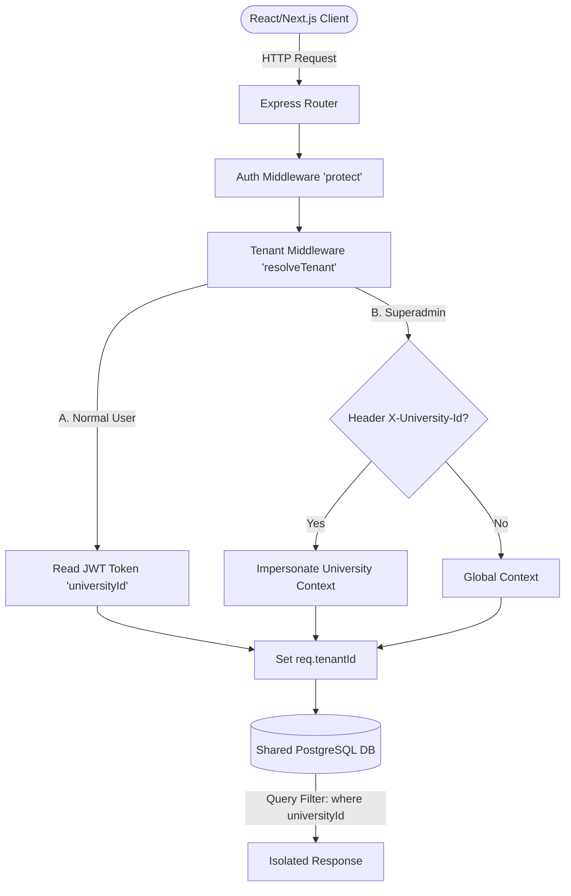

# Technical Implementation Document: Multi-Tenant SaaS Platform Upgrade

This document outlines the architectural changes, database schemas, code modules, and migration patterns implemented to transform the single-tenant **University Management System (UMS)** into an industry-grade, multi-tenant **Software-as-a-Service (SaaS)** platform.

---

## 1. Architectural Overview

The system has transitioned from a single-tenant instance to a **Shared Database, Logically Isolated Row-Level Multi-Tenant Architecture**. 

### Context Flow Diagram


---

## 2. Database Schema Design

The Prisma schema (`schema.prisma`) has been extended to support billing tiers, tenant metadata, and automatic row-level indexing.

### A. New SaaS Models
1. **`University`**: Represents a tenant university instance.
   * Fields: `id`, `code` (acronym), `name`, `slug` (subdomain), `logoUrl`, `primaryColor`, `contactEmail`, `websiteUrl`, `isActive`.
2. **`SaaSTier`**: Configures the subscription pricing models.
   * Fields: `id`, `name`, `displayName`, `monthlyPriceCents`, `yearlyPriceCents`, `maxUsers`, `maxApiCallsPerMonth`, `maxStorageGb`, `features` (JSON map), `overagePer1kCalls` (INR paisa).
3. **`UniversitySubscription`**: Tracks active contracts.
   * Fields: `id`, `universityId` (1:1 relationship), `tierId`, `status` (active/suspended/cancelled), `billingCycle` (monthly/yearly), `currentPeriodStart`, `currentPeriodEnd`.
4. **`ApiUsageDaily`**: Collects network metrics for billing calculations.
   * Fields: `id`, `universityId`, `date`, `totalRequests`, `successRequests`, `errorRequests`, `avgDurationMs`, `p95DurationMs`, `uniqueUsers`, `popularEndpoints` (JSON breakdown).

### B. Tenancy Fields & Compound Constraints
To prevent cross-tenant collisions (e.g. two schools having the same code in different universities), standard single unique constraints were refactored into compound indices.
* **`UserLogin`**: Added nullable `universityId` (allows global superadmin accounts without university constraints).
* **`FacultySchoolList`**, **`CentralDepartment`**, **`Role`**: Added required `universityId` field and updated constraints:
  * `FacultySchoolList`: `@@unique([universityId, facultyCode])`
  * `CentralDepartment`: `@@unique([universityId, departmentCode])`
  * `Role`: `@@unique([universityId, name])` and `@@unique([universityId, roleCode])`
* **`AuditLog`**, **`Notification`**, **`BugReport`**, **`IncentivePolicy`**: Added `universityId` for tenancy tracking and auditing.

---

## 3. Backend Tenancy Isolation Layer

### A. Global Middleware Resolution (`auth.js` & `tenant.middleware.js`)
Instead of refactoring 50+ individual controllers, tenant extraction is handled transparently inside the global request chain:
1. `protect` middleware decodes JWT and loads the authenticated user.
2. `resolveTenant` middleware is triggered immediately:
   * Extracts the base `universityId` from the user's login.
   * If the user is a `superadmin` and passes an `X-University-Id` header, it overrides `req.tenantId` (Context Switching).
   * Attaches `req.tenantId` to the express request object.
3. Every database query in subsequent controller handlers must scope search queries with:
   ```javascript
   where: { universityId: req.tenantId }
   ```

### B. Background Billing & Aggregator Daemon (`apiUsageAggregator.job.js`)
Runs daily at `00:30` using `node-cron` to aggregate yesterday's API usage:
* **P95 Latency Calculation**: Runs natively in database memory via `skip` and `take` offsets:
  ```javascript
  const p95Index = Math.max(0, Math.floor(count * 0.95) - 1);
  // Fetch only 1 record at the 95% mark, sorted by duration
  ```
* **Overage Calculation**: Computes extra calls beyond the pricing tier limits, multiplying by the tier's overage rates to record billing records.

---

## 4. Superadmin Management Module

Mounted under `/api/v1/superadmin/*` (restricted exclusively to `superadmin` role):
* **`superadmin.routes.js`**: Enforces auth role checks.
* **`superadmin.controller.js`**:
  * **SaaS Analytics Dashboard**: Returns global aggregate stats (MRR, users, active licenses).
  * **University CRUD**: Handles university updates, suspensions/activations, and configuration modifications.
  * **Provisioning wizard**: Transaction-wrapped deployment of a new university, default subscription setup, and creation of the first tenant administrator account.
  * **Live API Monitor**: Pulls real-time error rates, P95 metrics, and request distributions.

---

## 5. Frontend SaaS Console (Next.js & Tailwind CSS)

A dedicated SaaS console has been built under `/superadmin/` with custom aesthetics and separate routing layout parameters:

* **SaaS Shell Layout (`layout.tsx`)**: Isolated sidebar shell preventing standard dashboard queries from firing and throwing errors for non-tenant superadmins.
* **Admin Dashboard (`dashboard/page.tsx`)**: Global MRR tracking cards, quota warnings, and university usage grids.
* **Tenant Directory (`universities/page.tsx`)**: Quick search tools, suspension toggles, and **Impersonation login button** (stores active `universityId` inside local storage).
* **Provisioning Portal (`create/page.tsx`)**: Wizard interface creating the tenant, assigning plans, and setting up admin accounts.
* **Plan Creator (`billing/page.tsx`)**: Modal-based form editor to tweak pricing tiers, quotas, features (JSON maps), and overage prices.
* **Real-time API Monitor (`api-monitor/page.tsx`)**: Automated 30s poll console showing average latencies, P95 bounds, error rates, and endpoint breakdowns.
* **Request Interceptor (`api.ts`)**: Injects the `x-university-id` header on all outbound request contexts if an active impersonation ID exists in local storage.

---

## 6. Safe Migration & Backfill Strategy

To prevent constraint violations on non-empty legacy tables when applying the new database schema, we used a multi-step migration path:

```
[Prisma Schema Setup]
        │
        ▼
[Set universityId as Optional (?)]
        │
        ▼
[npx prisma db push --accept-data-loss]
        │
        ▼
[node prisma/migrate_tenancy.js] (Populate SGT tenant data)
        │
        ▼
[Set universityId as Required]
        │
        ▼
[npx prisma db push --accept-data-loss] (Lock database constraints)
```

### Backfill Execution Report:
* **Tiers provisioned**: Starter, Growth, Enterprise.
* **SGT University Tenant created** with Enterprise license.
* **Records migrated & updated**:
  * 37 `UserLogin` rows
  * 6 `FacultySchoolList` rows
  * 7 `CentralDepartment` rows
  * 2 `Role` rows
  * 8692 `AuditLog` rows
  * 35 `Notification` rows
  * 1 `IncentivePolicy` row

---

## 7. Verification & Syntax Diagnostics

1. **Prisma Typechecks**: Successfully ran `npx prisma generate` following process lock releases.
2. **Next.js Typechecks**: `npx tsc --noEmit` resolved with **0 compilation errors** in Next.js app routes.
3. **Node Syntax Checks**: Verified all created Express middleware, controllers, routes, and cron scripts. Output: **0 syntax errors**.
