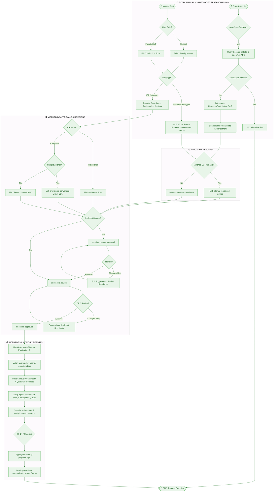
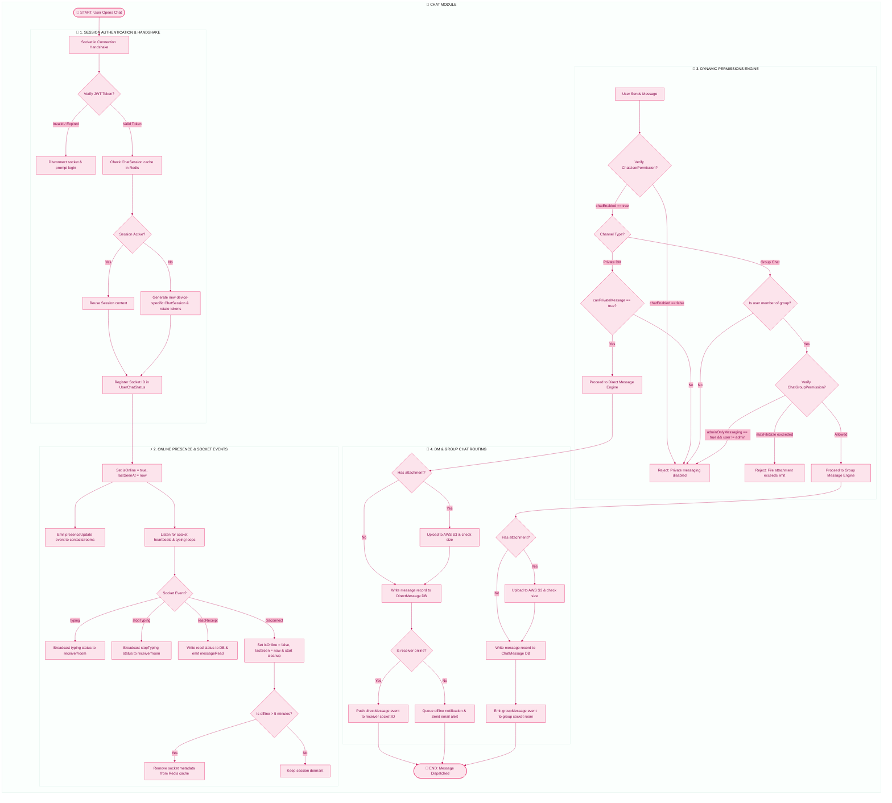
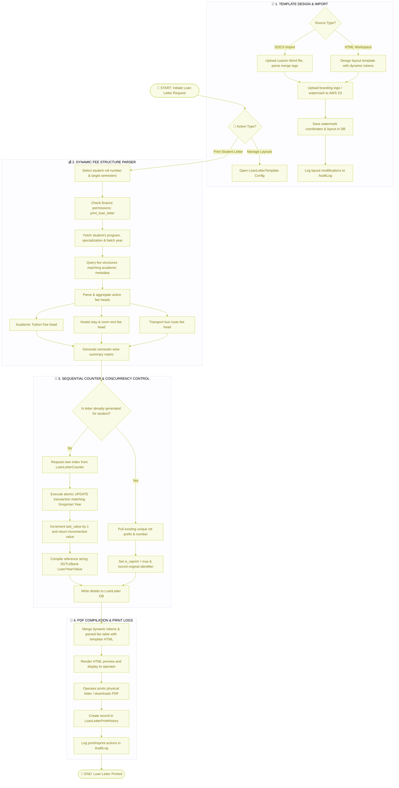
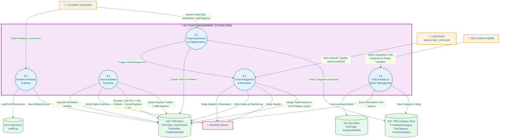

# SGT University Management System - Architecture Spec & Master Documentation

This document serves as the single source of truth for the SGT University Management System (UMS) architecture, detailing logical data flows, external integrations, backend schedulers, automation engines, security parameters, and data models.

---

## 🗺️ Master Dashboard System Map (Integration Flowchart)

The following flowchart illustrates the core components of the Master Dashboard and details exactly how each external module connects with these centralized features.

```mermaid
%%{init: {'theme': 'base', 'themeVariables': { 'primaryColor': '#e8f5e9', 'primaryTextColor': '#2e7d32', 'primaryBorderColor': '#81c784', 'lineColor': '#37474f', 'secondaryColor': '#e1f5fe', 'tertiaryColor': '#fff3e0'}}}%%

flowchart TB
    %% ═══════════════════════════════════════════════════════════════════
    %% MASTER DASHBOARD CORE FEATURES
    %% ═══════════════════════════════════════════════════════════════════
    subgraph MASTER_FEATURES["🎛️ MASTER DASHBOARD CORE FEATURES"]
        direction TB
        USER_MGMT["👤 USER MANAGEMENT<br/>- UserLogin profiles & hashes<br/>- Employee & Student details<br/>- Account status control (active/inactive)"]
        ACAD_MGMT["🏛️ ACADEMIC STRUCTURE<br/>- Schools, Depts, Programs<br/>- Specializations, Batches<br/>- Section capacities & teacher IDs"]
        PERM_MGMT["🔐 PERMISSIONS ENGINE<br/>- Central & School Dept mapping<br/>- Granular permissions (permissionDefinitions.js)<br/>- Assigned School scope bounds"]
        NOTIF_MGMT["🔔 NOTIFICATION ENGINE<br/>- SendGrid transactional emails<br/>- Real-time inbox database alerts<br/>- Read/Unread tracking status"]
        AUDIT_MGMT["📝 AUDIT LOG SYSTEM<br/>- Actor, severity, method logging<br/>- ChangeHistory value diffs (old/new JSON)<br/>- Daily/Weekly/Monthly cron jobs"]
    end

    %% ═══════════════════════════════════════════════════════════════════
    %% INTEGRATED SYSTEM MODULES & THEIR MAPPED INTERACTIONS (PDF SEQUENCE)
    %% ═══════════════════════════════════════════════════════════════════
    subgraph RESEARCH_MOD["🔬 1.0 RESEARCH & IPR"]
        R_FLOW["Research & IPR filing"]
        R_SYNC["Publication Sync / ORCID"]
        R_REP["Monthly Report Tracking"]
    end

    subgraph CHAT_MOD["💬 2.0 CHAT APPLICATION"]
        C_CONN["Socket Presence & DMs"]
        C_SESS["JWT Chat sessions"]
    end

    subgraph LOAN_MOD["📄 3.0 LOAN LETTER"]
        L_FLOW["Tuition calculations"]
        L_PRINT["PDF template printing"]
    end

    subgraph EVENT_MOD["🎪 4.0 EVENT MODULE"]
        E_FLOW["Event Lifecycle"]
    end

    subgraph DSW_MOD["🏛️ 5.0 DSW MODULE"]
        D_FLOW["Club Management"]
    end

    subgraph NOTING_MOD["📝 6.0 NOTING MODULE"]
        N_FLOW["Noting Workflows"]
    end

    subgraph RESOURCE_MGMT_MOD["🏢 7.0 RESOURCE RESERVATION & CAB BOOKING"]
        M_RES["Resource Reservation<br/>(Seminar Hall Booking)"]
        M_CAB["Cab Booking"]
    end

    subgraph MOM_MOD["📅 8.0 MEETING MINUTES (MoM)"]
        M_MOM["Meeting Minutes (MoM) Workspace"]
    end

    subgraph GATE_ENTRY_MOD["🚧 9.0 GATE ENTRY & PASSES"]
        G_PASS["Gate Pass & QR Scans"]
        G_HOSTEL["Hostel Booking Flow"]
    end

    subgraph TMS_MOD["🎫 10.0 TICKET MANAGEMENT SYSTEM (TMS)"]
        T_FLOW["Grievance Resolution"]
        T_ESC["Auto-Escalation Crons"]
    end

    %% ═══════════════════════════════════════════════════════════════════
    %% CONNECTION PATHS
    %% ═══════════════════════════════════════════════════════════════════
    
    %% Research Connections
    R_FLOW -->|"Checks DRD permissions<br/>(research_file/review/approve)"| PERM_MGMT
    R_FLOW -->|"Pulls student/author data"| USER_MGMT
    R_FLOW -->|"Notifies approval / resubmissions"| NOTIF_MGMT
    R_FLOW -->|"Logs evaluation status updates"| AUDIT_MGMT
    R_SYNC -->|"Automated syncing logs"| AUDIT_MGMT
    R_REP -->|"Triggers progress reports"| AUDIT_MGMT

    %% Chat Connections
    C_CONN -->|"Checks chat permissions<br/>(chatEnabled, canPrivateMessage)"| PERM_MGMT
    C_CONN -->|"Pulls chat participant data"| USER_MGMT
    C_CONN -->|"Pipes offline alerts"| NOTIF_MGMT
    C_SESS -->|"Verifies token states"| USER_MGMT

    %% Loan Letter Connections
    L_FLOW -->|"Checks finance permissions<br/>(print_loan_letter)"| PERM_MGMT
    L_FLOW -->|"Parses batched fee parameters"| ACAD_MGMT
    L_PRINT -->|"Pulls student credentials"| USER_MGMT
    L_PRINT -->|"Logs templates / prints details"| AUDIT_MGMT

    %% Event Connections
    E_FLOW -->|"Checks event roles<br/>(event_create/publish)"| PERM_MGMT
    E_FLOW -->|"Scopes visibility filters"| ACAD_MGMT
    E_FLOW -->|"Dispatches tickets & emails"| NOTIF_MGMT
    E_FLOW -->|"Logs transactions & Webhooks"| AUDIT_MGMT

    %% DSW Connections
    D_FLOW -->|"Checks club roles<br/>(dsw_manage_members)"| PERM_MGMT
    D_FLOW -->|"Appends approved clubs"| ACAD_MGMT
    D_FLOW -->|"Logs member updates"| AUDIT_MGMT

    %% Noting Connections
    N_FLOW -->|"Checks permissions<br/>(noting_create/approve)"| PERM_MGMT
    N_FLOW -->|"Triggers workflow alerts"| NOTIF_MGMT
    N_FLOW -->|"Logs approval transitions"| AUDIT_MGMT

    %% Resource Management Connections
    M_RES -->|"Checks booking permissions"| PERM_MGMT
    M_RES -->|"Allocates venue time slots"| ACAD_MGMT
    M_CAB -->|"Checks transport permissions"| PERM_MGMT
    M_CAB -->|"Logs vehicle trip routes"| AUDIT_MGMT

    %% Meeting Minutes Connections
    M_MOM -->|"Checks MoM permissions"| PERM_MGMT
    M_MOM -->|"Notifies committee attendees"| NOTIF_MGMT
    M_MOM -->|"Logs minutes publications"| AUDIT_MGMT
    M_MOM -->|"Pulls attendee credentials"| USER_MGMT

    %% Gate Entry Connections
    G_PASS -->|"Checks security permissions"| PERM_MGMT
    G_PASS -->|"Pulls student visitor details"| USER_MGMT
    G_PASS -->|"Logs check-in/out events"| AUDIT_MGMT
    G_HOSTEL -->|"Validates room allocations"| USER_MGMT
    G_HOSTEL -->|"Triggers check-in alerts"| NOTIF_MGMT

    %% TMS Connections
    T_FLOW -->|"Checks handler permissions"| PERM_MGMT
    T_FLOW -->|"Pulls submitter metadata"| USER_MGMT
    T_FLOW -->|"Dispatches status update alerts"| NOTIF_MGMT
    T_ESC -->|"Hourly escalation checks"| AUDIT_MGMT

    %% Styling
    classDef core fill:#e1f5fe,stroke:#0288d1,stroke-width:2px,color:#01579b
    classDef research fill:#e8f5e9,stroke:#4caf50,stroke-width:2px,color:#1b5e20
    classDef chat fill:#fce4ec,stroke:#e91e63,stroke-width:2px,color:#880e4f
    classDef loan fill:#f9fbe7,stroke:#c0ca33,stroke-width:2px,color:#827717
    classDef event fill:#fff8e1,stroke:#ffb300,stroke-width:2px,color:#ff6f00
    classDef dsw fill:#ede7f6,stroke:#673ab7,stroke-width:2px,color:#311b92
    classDef note fill:#f3e5f5,stroke:#9c27b0,stroke-width:2px,color:#4a148c
    classDef resource fill:#efebe9,stroke:#795548,stroke-width:2px,color:#4e342e
    classDef mom fill:#efebe9,stroke:#8d6e63,stroke-width:2px,color:#3e2723
    classDef gate fill:#e0f2f1,stroke:#009688,stroke-width:2px,color:#004d40
    classDef tms fill:#fbe9e7,stroke:#ff5722,stroke-width:2px,color:#d84315

    class USER_MGMT,ACAD_MGMT,PERM_MGMT,NOTIF_MGMT,AUDIT_MGMT core
    class R_FLOW,R_SYNC,R_REP research
    class C_CONN,C_SESS chat
    class L_FLOW,L_PRINT loan
    class E_FLOW event
    class D_FLOW dsw
    class N_FLOW note
    class M_RES,M_CAB resource
    class M_MOM mom
    class G_PASS,G_HOSTEL gate
    class T_FLOW,T_ESC tms
```



---

## 🏁 System Overview (Level 0 DFD)

The Level 0 Context Diagram abstracts the entire SGT-UMS platform into a single central node, illustrating how external users interact with database and file stores.

```mermaid
%%{init: {'theme': 'base', 'themeVariables': { 'primaryColor': '#e1f5fe', 'primaryTextColor': '#01579b', 'primaryBorderColor': '#0288d1', 'lineColor': '#37474f', 'secondaryColor': '#fff3e0', 'tertiaryColor': '#e8f5e9'}}}%%

flowchart TB
    subgraph External_Entities["🏢 UMS External Entities"]
        direction TB
        STUDENT["👨‍🎓 STUDENT<br/><i>Student Profile / Applicant</i>"]
        FACULTY["👨‍🏫 FACULTY<br/><i>Academic / Approver / Mentor</i>"]
        STAFF["👔 STAFF<br/><i>Administrative / HR / Finance</i>"]
        ADMIN["🔐 ADMIN/SUPERADMIN<br/><i>System Administrator / IT</i>"]
        DSW["🏛️ DSW OFFICE<br/><i>Dean of Student Welfare Office</i>"]
        VOLUNTEER["🙋 VOLUNTEER<br/><i>Event Scanning Staff</i>"]
        PUBLIC["🌐 PUBLIC USER<br/><i>Verification / External</i>"]
        CHAT_USER["💬 CHAT CLIENT<br/><i>Web / Mobile Chat User</i>"]
    end

    subgraph System["🎓 SGT UNIVERSITY MANAGEMENT SYSTEM"]
        CORE(("0<br/>SGT-UMS<br/><br/>Central Master Dashboard,<br/>Noting, Research, Chat,<br/>& Finance Modules"))
    end

    subgraph Data_Stores["🗄️ System Data Stores"]
        DB[(📦 PostgreSQL<br/>Core DB)]
        REDIS[(⚡ Redis<br/>Cache & Sessions)]
        S3[(☁️ AWS S3<br/>Storage)]
        RAZORPAY[💳 Razorpay<br/>Payment Gateway]
        SENDGRID[📧 SendGrid<br/>Email System]
    end

    %% Student Flows
    STUDENT -->|"Register Events / Apply for Clubs<br/>Submit Research / Request Loan Letter"| CORE
    CORE -->|"QR Tickets / Certificates / Status Updates<br/>Printed Loan Letter PDF"| STUDENT

    %% Faculty Flows
    FACULTY -->|"Create Noting Requests / Recommend Papers<br/>Manage Club Members / Mentor Students"| CORE
    CORE -->|"Noting Status Alerts / Review Queues<br/>Mentor Workload Metrics"| FACULTY

    %% Staff Flows
    STAFF -->|"Process Accounts / Manage Leave<br/>Approve Registrations / Print Letters"| CORE
    CORE -->|"Administrative Analytics<br/>Print Previews"| STAFF

    %% Admin Flows
    ADMIN -->|"Configure System / Assign Permissions<br/>Manage Infrastructure / Audit Policies"| CORE
    CORE -->|"System Logs / Security Alerts<br/>Performance Analytics"| ADMIN

    %% DSW Office Flows
    DSW -->|"Approve Club Notings / Configure Categories"| CORE
    CORE -->|"Club Workload / Member Lists"| DSW

    %% Volunteer Flows
    VOLUNTEER -->|"QR Attendance Scans / Entry Records"| CORE
    CORE -->|"Verification Status"| VOLUNTEER

    %% Public Flows
    PUBLIC -->|"Certificate Verification Request"| CORE
    CORE -->|"Certificate Validity Status"| PUBLIC

    %% Chat Flows
    CHAT_USER -->|"Socket Connection Handshake<br/>Encrypted Messages / Typing Signals"| CORE
    CORE -->|"Real-time DM / Group Feeds<br/>Online Presence Status"| CHAT_USER

    %% Data Store Connections
    CORE <-->|"CRUD / SQL Queries"| DB
    CORE <-->|"Cache Read/Write / Auth Tokens"| REDIS
    CORE <-->|"Upload Media / PDF Templates / DOCX"| S3
    CORE <-->|"Process Payments / Webhooks"| RAZORPAY
    CORE <-->|"Transactional & Scheduled Emails"| SENDGRID

    classDef external fill:#fff3e0,stroke:#ff9800,stroke-width:2px,color:#e65100
    classDef system fill:#e3f2fd,stroke:#1976d2,stroke-width:3px,color:#0d47a1
    classDef datastore fill:#e8f5e9,stroke:#4caf50,stroke-width:2px,color:#1b5e20
    classDef extservice fill:#fce4ec,stroke:#e91e63,stroke-width:2px,color:#880e4f

    class STUDENT,FACULTY,STAFF,ADMIN,DSW,VOLUNTEER,PUBLIC,CHAT_USER external
    class CORE system
    class DB,REDIS,S3 datastore
    class RAZORPAY,SENDGRID extservice
```



---

## 1.0 NOTING MODULE

Collaborative workflow engine managing draft generation, sequential signatures, forward/revert routing, and automated entity spawning.

#### Processes
- **1.1 Create Noting**: Users draft notes, attaching supporting documents.
- **1.2 Submit Noting**: Commits drafts to the active workflow database.
- **1.3 Approval Workflow**: Routes requests to assigned department approvers based on central authority definitions.
- **1.4 Forward/Reject**: Allows forwarding up the hierarchy or rejecting back with comments.
- **1.5 Copy Distribution**: Automatically distributes official copies of approved notes to stakeholders.
- **1.6 Auto-Create Entity**: Post-approval trigger automatically instantiates linked structures (e.g., creating a Club or an Event).

---

## 2.0 DSW MODULE

Dean of Students' Welfare system managing student groups, member roles, and engagement tracking.

#### Processes
- **2.1 Category Management**: Administrators configure club categories (e.g., Cultural, Technical).
- **2.2 Club Creation**: Instantiates a club record once an approved noting is received.
- **2.3 Member Management**: Facilitators assign roles (Chair, Tech Lead, Member) to students.
- **2.4 Application Review**: Evaluates student requests to join clubs.
- **2.5 Audit Logging**: Trails DSW structural updates and member role updates.
- **2.6 Statistics Dashboard**: Calculates aggregate member stats and club health index.

---

## 3.0 EVENT MANAGEMENT MODULE

End-to-end university event organizer featuring payment integration, attendance tracking, and verification.

#### Processes
- **3.1 Event Discovery**: Renders published events with category-based filtering.
- **3.2 Event Registration**: Form captures individual data and issues a unique QR ticket.
- **3.3 Team Management**: Supports student-led team creation for inter-university competitions.
- **3.4 Payment Processing**: Integrates Razorpay API for fee settlement and logs webhook confirmations.
- **3.5 QR Scan Attendance**: Scans QR codes at venue entries to record check-in logs.
- **3.6 Volunteer Management**: Grants scanning permissions to volunteer staff.
- **3.7 Certificate Generation**: Fills PDF templates on AWS S3 and distributes them.
- **3.8 Feedback Collection**: Captures 10-point ratings and feedback reviews.
- **3.9 Stall Management**: Handles applications for food/activity stalls at college fests.
- **3.10 Bulk Email System**: Distributes batch emails via SendGrid with delivery tracking.
- **3.11 Analytics Dashboard**: Reports financial returns, attendance ratios, and feedback ratings.

---

## 4.0 UMS MASTER DASHBOARD SPECIFICATION

The UMS Master Dashboard acts as the central coordinator, implementing profile configurations, hierarchical metadata structures, scope-gated permissions, alert notifications, and scheduled audit pipelines.

**Mermaid Diagram Source:** `docs/DFD_Level1_MasterDashboard.mmd`

```mermaid
%%{init: {'theme': 'base', 'themeVariables': { 'primaryColor': '#e1f5fe', 'primaryTextColor': '#01579b', 'primaryBorderColor': '#0288d1', 'lineColor': '#37474f'}}}%%

flowchart TB
    ADMIN["🔐 ADMIN / IT ADMIN"]
    STAFF["👔 STAFF / HR STAFF"]
    STUDENT["👨‍🎓 STUDENT"]
    FACULTY["👨‍🏫 FACULTY / ACADEMIC STAFF"]
    PARENT["👨‍👩‍👧 PARENT"]

    DB_USER[("D4: User Store<br/>UserLogin, EmployeeDetails,<br/>StudentDetails, ParentDetails")]
    DB_ACAD[("D9: Academic Store<br/>FacultySchoolList, Department,<br/>Program, Specialization, Section")]
    DB_PERM[("D10: Permission Store<br/>UserDeptPermission,<br/>DeptPermission, CentralDeptPermission")]
    DB_NOTIF[("D11: Notification Store<br/>Notification")]
    DB_AUDIT[("D12: Audit Store<br/>AuditLog, ChangesHistory,<br/>AuditReportConfig/History")]
    CACHE[("D7: Redis Cache<br/>Auth Sessions, Permissions")]
    SENDGRID["📧 SendGrid Service"]

    subgraph MASTER_DASHBOARD["🎛️ 4.0 UMS MASTER DASHBOARD"]
        direction TB
        P4_1(("4.1<br/>User Profile<br/>Management"))
        P4_2(("4.2<br/>Academic Structure<br/>Management"))
        P4_3(("4.3<br/>Department & Scope<br/>Permissions"))
        P4_4(("4.4<br/>Notification<br/>Dispatcher"))
        P4_5(("4.5<br/>Audit Logging &<br/>Reports"))
    end

    STAFF -->|"Create/Update Employee"| P4_1
    ADMIN -->|"Manage Student/Parent/Staff Accounts"| P4_1
    STUDENT -->|"Update Student Profile"| P4_1
    PARENT -->|"View/Update Parent Details"| P4_1
    P4_1 -->|"Read/Write User Data"| DB_USER
    P4_1 -->|"Session Cache"| CACHE
    P4_1 -->|"Profile Change Event"| P4_5

    ADMIN -->|"Define School/Dept/Program/Section"| P4_2
    FACULTY -->|"View Courses & Student Sections"| P4_2
    P4_2 -->|"Read/Write Academic Data"| DB_ACAD
    P4_2 -->|"Structure Update Log"| P4_5

    ADMIN -->|"Assign Dept/Central/School Permissions"| P4_3
    P4_3 -->|"Save Permissions"| DB_PERM
    P4_3 -->|"Cache User Permissions"| CACHE
    P4_3 -->|"Permission Change Log"| P4_5
    
    P4_1 -->|"Notification Event"| P4_4
    P4_2 -->|"Course Allocation Alert"| P4_4
    P4_3 -->|"Security Alert (Grant/Revoke)"| P4_4
    P4_4 -->|"Persist Alerts"| DB_NOTIF
    P4_4 -->|"Send Mail Alerts"| SENDGRID
    SENDGRID -->|"Delivery Status"| P4_4
    STUDENT -->|"Fetch Alerts"| P4_4
    FACULTY -->|"Fetch Alerts"| P4_4

    P4_1 -.->|"CRUD Trigger"| P4_5
    P4_2 -.->|"Metadata Trigger"| P4_5
    P4_3 -.->|"Security Trigger"| P4_5
    ADMIN -->|"Configure Audit Schedule / View logs"| P4_5
    P4_5 -->|"Save Audit Trails & Values"| DB_AUDIT
    P4_5 -->|"Read Change History"| DB_AUDIT
    P4_5 -->|"Dispatch Audit Reports"| SENDGRID

    classDef external fill:#fff3e0,stroke:#ff9800,stroke-width:2px
    classDef process fill:#e3f2fd,stroke:#1976d2,stroke-width:2px
    classDef datastore fill:#e8f5e9,stroke:#4caf50,stroke-width:2px
    classDef extservice fill:#fce4ec,stroke:#e91e63,stroke-width:2px
    classDef module fill:#f3e5f5,stroke:#9c27b0,stroke-width:3px

    class ADMIN,STAFF,STUDENT,FACULTY,PARENT external
    class P4_1,P4_2,P4_3,P4_4,P4_5 process
    class DB_USER,DB_ACAD,DB_PERM,DB_NOTIF,DB_AUDIT,CACHE datastore
    class SENDGRID extservice
    class MASTER_DASHBOARD module
```



### Processes Breakdown
- **4.1 User Profile Management**: Manages accounts for Students, Faculty, Staff, and Parents. Creates records, handles hashed passwords, updates status, and invalidates session caches upon changes.
- **4.2 Academic Structure Management**: Handles the hierarchical academic tree (Schools/Faculties $\rightarrow$ Departments $\rightarrow$ Programs $\rightarrow$ Specializations $\rightarrow$ Classes/Sections). Allocates class teacher IDs and class capacities.
- **4.3 Department & Scope Permissions**: Implements IT security policies. Maps department roles (e.g. `hr`, `drd`, `finance`, `library`) to granular permissions and assigns school-level scope restrictions. Caches resulting tokens in Redis.
- **4.4 Notification Dispatcher**: Receives system event triggers (e.g. noting updates, alerts, permission changes) and formats them into database notifications (`isRead` flag tracking) and dispatches emails via SendGrid.
- **4.5 Audit Logging & Reports**: A system-wide hook capturing all API write operations. Logs the actor, table name, record ID, IP address, user agent, old JSON values, new JSON values, and severity levels. Schedules daily, weekly, or monthly report outputs compiled into reports.

---

## 5.0 RESEARCH MODULE & IPR/POLICY ECOSYSTEM

The Research module maps scholarly achievements and intellectual properties. It implements automated indexing, API integrations, co-author allocation, and dynamic financial rules.



### 1. Research Subsystems (Publications, Books, Chapters, Conferences, Grants)
The research catalog maps into the main database containing specific properties:
- **Research Publications**: Documents Scopus, WoS, or UGC-indexed journals. Tracks DOI, impact factors, SJR quartiles, page numbers, and SGT affiliations.
- **Books & Chapters**: Evaluates monographs or multi-authored chapters. Logs ISBN, publisher names, and indexing lists.
- **Conference Papers**: Maps national or international paper presentations. Captures venue details, proceedings quartiles, and physical vs. virtual presentations.
- **Grants**: Maps government and corporate research proposals. Logs requested amounts, sanctioned funding values, duration timelines, and investigator details.

### 2. IPR Subsystem (Patent, Copyright, Trademark, Design)
The Intellectual Property Rights (IPR) database model handles 4 distinct types of systems, each containing specific workflow attributes:
- **Patents**: Provisional or complete technical inventions. Provisional filings require abstract descriptions and prototype specifications. Complete filings require detail disclosures.
- **Copyrights**: Logs software codes, lecture notes, or literary submissions.
- **Trademarks**: Handles logo and phrase representations.
- **Designs**: Registers industrial product blueprints.

#### IPR Filing & Conversion Workflow
```
[Provisional Filing] ───────────────► [complete Filing]
(Saves provisional spec)           (Initiates Complete Application)
          │                                   │
          │ (Within 12-month window)          │
          ▼                                   ▼
[Conversion Date Captured] ─────────► [submitted to Govt] ──► [published / Granted]
(Links complete application to         (Records govt number)
 source Provisional ID)
```
- **Provisional filing**: Initiates provisional specs. Captures filing date and issues local numbering.
- **Complete filing**: A full disclosure filing.
- **Conversion logic**: Provisional filings have a 12-month statutory window to convert to complete filings. If completed, the Complete application captures the `sourceProvisionalId` and matches the conversion date.

### 3. Automated Sync & Scraper Engines
The research system connects to external API indexes to sync faculty research profiles:
- **ORCID API Sync**: Hooks into `https://pub.orcid.org/v3.0` to pull member publications, sync biography strings, and reconcile co-author lists.
- **Scopus Elsevier API**: Integrates Elsevier's content API to query metadata matching `scopusAuthorId` hashes. Parses journal quartiles, citations, and journal impact fields.
- **OpenAlex Engine**: Integrates open academic metadata endpoints to resolve cross-disciplinary work automatically.
- **Affiliation string resolver**: Cleans and matches author affiliations. Compares text strings against 32+ predetermined variant arrays:
  - Variants: `"sgt university"`, `"sgtu"`, `"shree guru gobind singh tricentenary university"`, `"budhera"`.
  - Determines `sgtAffiliatedAuthors` count and automatically matches co-author details with registered student/employee profiles inside database stores.

### 4. Dynamic Policy Calculation Rules
Once a contribution status becomes `approved`, the dynamic evaluation calculator runs:
- **Journal Incentive Matching**: Matches policy using current publishing year bounds:
  $$I_{total} = (I_{base} + B_{index} + B_{IF}) \times M_{role}$$
  - Base values: Scopus ($5,000$), Web of Science ($7,500$), Scopus + WoS ($10,000$).
  - Impact Factor (IF) tiers: $IF \le 1.0 = 0$, $1.0 < IF \le 3.0 = 5,000$, $3.0 < IF \le 5.0 = 10,000$, $IF > 5.0 = 20,000$.
- **Author Split Percentages**:
  - Matches author count and roles. First Author receives 40%, Corresponding Author receives 30%.
  - Remaining 30% is split equally among co-authors.
  - If a user is both First and Corresponding Author, they receive 70%.

### 5. Monthly Report & Progress Tracker
- **State tracker**: Monitors pre-submission phases (`writing` $\rightarrow$ `under_submission` $\rightarrow$ `revised` $\rightarrow$ `published`).
- **Monthly report system**: Operates via a monthly cron scheduler (`0 0 1 * *`) inside `auditScheduler.service.js`. It queries the database, compiles progress trackers by school department, generates report schedules, and emails summaries to deans and directors.

---

## 6.0 CHAT APPLICATION SYSTEM

The Chat Application runs real-time websocket protocols using Socket.io, integrating session keys, access security, and notifications.



### 1. Handshakes, Token Rotations & Encryption
- **Handshake phase**: When a socket connects, the middleware verifies the JWT.
- **Token rotation**: Creates a device-specific `ChatSession` record. Tracks refresh token hashes, device models, platforms, and expiration windows.
- **Security & encryption**: Supports encrypted content options in database tables. Handles binary uploads to AWS S3, checking size ceilings.

### 2. Group Chats & Direct Messaging (DMs)
- **Direct messages**: Creates private channels (`DirectMessage` model) referencing `senderId` and `receiverId`. Emits message payloads directly to recipient socket channels.
- **Group chats**: Groups are defined in `ChatGroup` tables with group-level policies (`ChatGroupPermission`). Users are tracked in `ChatGroupMember` tables. Dispatched messages are routed to group socket rooms.
- **Typing indicators & status**: Emits `typing` / `stopTyping` socket events. Syncs `UserChatStatus` (socket IDs, last seen date, isOnline state).

### 3. User Permission Gating vs. Group-Level Overrides
- **User-level access (`ChatUserPermission`)**:
  - `chatEnabled`: Enable/Disable entire chat module access.
  - `canPrivateMessage`: Restrict user from initiating new private DMs.
  - `canCreateGroup`: Restrict user from creating group channels.
- **Group-level overrides (`ChatGroupPermission`)**:
  - `adminOnlyMessaging`: Locks messaging to admins only.
  - `maxFileSize`: Overrides standard file size ceilings.
  - `privateDMAllowed`: Determines if group members can click on profiles to DM.

---

## 7.0 LOAN LETTER MODULE

The Finance Loan Letter module parses fee rates, manages layouts, and implements sequential generation numbering locks.



### 1. Template Configurations
- **Watermark & Logo**: Single-instance `LoanLetterTemplate` configures opacities, dimensions, alignments, and branding coordinates. Uploads assets to AWS S3.
- **DOCX Import handler**: Supports importing custom templates directly from DOCX documents.
- **Template Body**: Stores layout HTML containing dynamic merge tokens (e.g. `{{studentName}}`, `{{tuitionTable}}`).

### 2. Dynamic Fee Structure Parser
When letter generation begins, the parser matches active fees:
- **Matching criteria**: Student batch year, program, specialization, and selected semesters.
- **Fee heads aggregated**:
  - Academic Tuition Fee.
  - Hostel Fee (based on selected room types and hostel configurations).
  - Transport Bus Fee (based on selected routes).
- Compiles semester-wise fees dynamically to output tables.

### 3. Concurrency Counter Locks & PDF Generation
- **Unique reference number**: Matches prefix `refPrefix` (default `SGTU/Bank Loan`).
- **Atomic index database locks**: Queries `LoanLetterCounter` matching the current Gregorian year. To prevent print concurrency collisions:
  ```sql
  -- Atomic database update lock
  UPDATE loan_letter_counter
  SET last_value = last_value + 1
  WHERE counter_year = 2026
  RETURNING last_value;
  ```
  This creates a sequential reference code: `SGTU/Bank Loan/2026/047`.
- **Reprint controls**: If a printed letter is re-generated, it references the existing unique record, preventing the consumption of a new counter index. Logs reprint actions in `LoanLetter` database records.

---

## 8.0 TICKET MANAGEMENT SYSTEM (TMS) MODULE

The TMS module provides a complete university ticket grievance system for students and staff, utilizing a dynamic escalation workflow and automated scheduling.

**Mermaid Diagram Source:** `docs/DFD_Level1_TMS.mmd`



### 1. Ticket Submission & 3-Tier Categorization
- **Submission**: Students input support requests. The categorization follows a nested structure: `TmsMasterCategory` $\rightarrow$ `TmsCategory` $\rightarrow$ `TmsSubCategory`.
- **Assignment**: Automatically routes to the employee assigned to handle the selected `TmsSubCategory`.

### 2. Auto-Escalation & 48-Hour Inaction Rule
- **Scheduler**: A background job (`tmsEscalationScheduler.service.js`) triggers a cron check every hour (`0 * * * *`).
- **Escalation Path**: If a ticket remains unresolved for more than 48 hours without update, it is auto-escalated to the next tier in the authority chain:
  $$\text{Sub-Category Employee} \rightarrow \text{Category Employee} \rightarrow \text{Master Category Employee} \rightarrow \text{Registrar (Admin) / Dean (Academic)} \rightarrow \text{Vice Chancellor (VC)}$$
- **Deadline Updates**: Auto-escalated tickets write timeline entries (`action: 'AUTO_ESCALATED'`) and assign the new handler dynamically, resetting the escalation deadline.

### 3. Ratings & Grievance Feedback Loop
- **Resolution**: Handler marks ticket as `resolved` and inputs action comments.
- **Rating**: The student rates the resolution ($1\text{ to }5\text{ scale}$) in the `TmsRating` table. Feedback comments update the ticket, switching status to `closed`.

---

## 9.0 RESOURCE MANAGEMENT (SEMINAR HALL & CAB BOOKING)

This module handles university facility allocations, scheduling Seminar Hall reservations and Cab/Vehicle trip bookings.

### 1. Seminar Hall Bookings
- **Hall Inventory**: Models structural properties: Blocks contain Floors, which house Seminar Hall Rooms (capacities, locations, and facilities).
- **Booking Requests**: Resolves conflicts by checking slots dynamically. Logs details (dates, start/end timestamps, title/purpose).
- **Admins Check-In**: Monitors room booking statuses and records check-in and check-out logs to database archives (`SeminarHallBookingHistory`).

### 2. Cab & Vehicle Booking
- **Fleet Management**: Manages profiles of university cabs, buses, and designated drivers.
- **Booking Flow**: Faculty and staff request cabs for official outstation or local journeys, defining dates, times, vehicle types, and routes.
- **Verification & Approval**: Automatically forwards requests to the transport department manager. On approval, assigns a driver and vehicle, logging details to `AuditLog`.

---

## 10.0 GATE ENTRY & PASSES

The Gate Entry module manages campus access logs, checking in visitors, student leave passes, employees, and vehicles using QR verification and hostel booking details.

### 1. Gate Pass Verification
- **Leave Passes**: Students request gate passes (local exit, home visit). On warden approval, a unique QR code is generated.
- **Verification**: Guards at checkposts scan the QR ticket, which checks against the student status and records entry/exit timestamps inside the `gate_pass_daily_entry` table.
- **Visitor Passes**: Registers visitor profiles, host employees, vehicle models, numbers, and purpose. Logs vehicle parking allocations.

### 2. Hostel Booking Integration
- **Hostel Overnight Stay**: Integrates visitor check-in with overnight hostel room allotments.
- **Refund Validation**: Tracks booking cancellations and calculates refunds dynamically based on check-in timelines and durations.

---

## 11.0 MEETING MINUTES (MoM) MODULE

This module provides a complete workspace for drafting, approving, and distributing formal committee Meeting Minutes (MoM) independently of the Noting module.

**Mermaid Diagram Source:** `docs/DFD_Level1_MeetingMinutes.mmd`

### 1. Minutes Drafting
- **Data Capture**: Meeting organizers create MoM drafts detailing committee agendas, decisions, attendee presence grids, and task action items. Supports file attachments and transcription document uploads to AWS S3.
- **Data Store**: Persists details directly into the independent MoM Store.

### 2. Independent Approval Flow
- **Review and Approval**: Routes draft MoMs directly to designated Approving Officers or Deans.
- **Status Progression**: Transitions across `draft` $\rightarrow$ `under_review` $\rightarrow$ `approved` / `changes_required` statuses. Approved records lock dynamically to prevent modifications.

### 3. Copy Distribution & Notification
- **Alert Dispatch**: Approval triggers email campaigns via SendGrid to all registered attendees, including secure PDF download attachments.
- **In-App Feeds**: Places notifications in user dashboards with link summaries.

---

## 🔗 Cross-Module Integration Matrix (Expanded)

| Source Module | Destination | Integration Flow & DB triggers |
|---|---|---|
| **1.0 Noting** | **2.0 DSW** | Approved noting files with subcategory `dsw_approve_noting` invoke triggers to automatically create new records in `Club` tables. |
| **1.0 Noting** | **3.0 Event Management**| Approved noting files with subcategory `event_approve` trigger backend hooks to automatically compile new records in `Event` tables. |
| **4.0 Master Dashboard**| **6.0 Chat System** | User login deactivation immediately severs websocket channels and invalidates JWT session hashes. |
| **6.0 Chat System** | **4.0 Master Dashboard**| Offline messages dispatch database notifications, rendering alerts and incrementing unread counters in the dashboard header. |
| **5.0 Research Module** | **4.0 Master Dashboard**| Status changes trigger audit logger tracks. Approvals send SendGrid mail logs to applicants. |
| **7.0 Loan Letter** | **4.0 Master Dashboard**| Generation actions record printer and reprint details in the central master audit logging table. |
| **8.0 TMS Module** | **4.0 Master Dashboard**| Support tickets dispatch notifications to student users and log timeline changes to the central audit log database. |
| **10.0 Gate Entry** | **4.0 Master Dashboard**| Check-in/out logs record real-time security alerts and sync student attendance changes on the main employee dashboard. |
| **11.0 Meeting Minutes**| **4.0 Master Dashboard**| Finalized MoM approvals trigger automated attendee database alerts and SendGrid email notifications. |

---

## 📑 Data Store Registry (Updated)

| Store ID | Data Store Name | Database Tables / Models | Technical Purpose & Technology |
|---|---|---|---|
| **D1** | Noting DB | `note`, `note_history`, `note_copy`, `note_attachment` | PostgreSQL (Prisma ORM) - approval workflow histories and copy lists. |
| **D2** | Club DB | `club`, `club_member`, `club_category`, `club_audit_log` | PostgreSQL - DSW club configurations and student role memberships. |
| **D3** | Event DB | `event`, `event_registration`, `event_team`, `event_volunteer` | PostgreSQL - event lifecycles, ticketing, and volunteer limits. |
| **D4** | User Store | `user_login`, `employee_details`, `student_login` | PostgreSQL - accounts, security hashes, profiles, and basic user metadata. |
| **D5** | Payment Store | `payment`, `event_coupon`, `coupon_usage` | PostgreSQL - Razorpay receipt details and transaction statuses. |
| **D6** | Certificate Store | `event_certificate_template`, `event_certificate_log` | PostgreSQL - event credential logs and SVG/HTML template paths. |
| **D7** | Redis Cache | In-Memory Key-Value Stores | Redis - JWT session caches, permission lookups, and analytics caching. |
| **D8** | AWS S3 Storage | Cloud File Blobs | AWS S3 - manuscript drafts, certificate PDFs, templates, and profile photos. |
| **D9** | Academic Store | `faculty_school_list`, `department`, `program`, `section` | PostgreSQL - schools, departments, degrees, and sections. |
| **D10**| Permission Store | `user_department_permission`, `department_permission` | PostgreSQL - school-level and central-department permission logs. |
| **D11**| Notification Store| `notification` | PostgreSQL - transactional system notices, chat alerts, and read timestamps. |
| **D12**| Audit Store | `audit_log`, `changes_history`, `audit_report_config` | PostgreSQL - logging write operations, values, and reporting setups. |
| **D13**| Research Store | `research_contribution`, `research_paper_review` | PostgreSQL - research submissions, author splits, and revision details. |
| **D14**| Tracker Store | `research_progress_tracker` | PostgreSQL - logs pre-submission paper drafting states. |
| **D15**| Policy Store | `research_incentive_policy`, `book_incentive_policy` | PostgreSQL - incentive settings, tiers, and role percentage splits. |
| **D16**| Chat Store | `chat_group`, `chat_group_member`, `chat_message` | PostgreSQL - chat groups, user lists, messages, and DM logs. |
| **D17**| Chat Perm Store | `chat_user_permission`, `chat_group_permission` | PostgreSQL - chat-specific user limits and group settings overrides. |
| **D18**| Session Store | `chat_session`, `user_chat_status` | PostgreSQL - chat JWT tokens, socket IDs, online status, and last seen. |
| **D19**| Loan Letter Store | `loan_letter`, `loan_letter_template`, `counter` | PostgreSQL - letters, templates, and sequential number counters. |
| **D20**| Fee Structure Store| `fee_structure`, `fee_head` | PostgreSQL - academic, hostel, and transport fee schedules. |
| **D21**| TMS Store | `tms_ticket`, `tms_timeline`, `tms_rating` | PostgreSQL - grievance tickets, actions, and client evaluation ratings. |
| **D22**| TMS Category Store| `tms_master_category`, `tms_category` | PostgreSQL - ticket category hierarchies and assigned role handlers. |
| **D23**| Booking Store | `seminar_hall_room`, `booking_request` | PostgreSQL - seminar rooms, capacities, and booking approval records. |
| **D24**| Gate Pass Store | `gate_pass`, `gate_pass_daily_entry`, `gate_pass_history` | PostgreSQL - leave pass applications, visitor profiles, and entry check-ins. |
| **D25**| MoM Store | `meeting_minutes`, `meeting_minutes_history`, `meeting_minutes_attendee` | PostgreSQL - meeting schedules, committee presence records, and decisions. |

---

## 🔐 UMS Permission Matrix (Updated)

Core permissions are defined dynamically in `permissionDefinitions.js` and parsed in user authorization middleware.

### 1. School Department Permissions (Scoped to Academic Departments)
- `view_dashboard`: Grants view access to department dashboard.
- `view_reports`: Can view basic department reports.
- `export_data`: Allows export of department rosters to Excel.
- `view_students`: Can view student records in department.
- `add_students`: Can add students to department sections.
- `approve_students`: Approves student details and registration profiles.
- `view_faculty`: Can view faculty rosters and profiles.
- `assign_courses`: Can allocate courses to faculty members.
- `view_courses`: Can view program syllabi and catalog.
- `enter_marks`: Enter marks for students in class sections.
- `approve_marks`: Approve finalized marks before result publication.

### 2. Central Department Permissions
- **HR**: `view_employees` (view profiles), `manage_payroll` (calculate payroll).
- **ERP**: `configure_erp` (system settings, workflows, logs).
- **DRD (Research)**:
  - `research_file_new`: File new research contributions (Faculty/Student default).
  - `research_review`: Review pending submissions (Scoped to assigned school departments).
  - `research_approve`: DRD head final approval and credit calculation.
  - `research_assign_school`: Assign schools to DRD reviewers.
  - `monthly_report_view`: View progress tracker reports for assigned school/departments.
- **Finance**:
  - `configure_fee_structure`: Configure tuition, bus, and hostel rates.
  - `print_loan_letter`: Generate and print bank loan letters.
- **DSW**: `dsw_create_club` (create clubs), `dsw_approve_noting` (approve club proposals).
- **Noting**: `noting_create` (initiate notings), `noting_approve` (approve sequential notes).
- **Events**: `event_create` (create events), `event_publish` (publish details).
- **Transport**: `transport_book_cab` (initiate cab bookings), `transport_approve_cab` (approve vehicle requests).
- **Security & Gate**: `gate_verify_pass` (verify student QR passes), `gate_log_visitor` (register entry/exit visitor logs).

---

## 🧪 Testing Specs & QA Validation Matrices (Updated)

### 1. TMS Auto-Escalation Check
- **48-Hour Check**: Add a test ticket under a category employee. Manipulate the `createdAt` date to be $>48\text{ hours}$ in the past. Trigger the cron scheduler. Confirm status automatically changes to `escalated` and the assignee updates to the category supervisor.
- **VC Cap**: Attempt to escalate a ticket that is already at the Vice Chancellor (`VICE_CHANCELLOR`) level. Ensure it does not change handlers, records a final escalation remark, and rejects further auto-escalations gracefully.

### 2. Seminar Hall Booking & MoM Approvals
- **Double Booking**: Attempt to book the same seminar hall room for overlapping time slots on the same date. Ensure database transactions return conflict validation errors.
- **MoM Distribution**: Test the post-approval of a Meeting Minutes request. Confirm that the SendGrid service executes automatically and sends download PDFs to all listed email addresses in the attendee JSON block.

### 3. Gate Entry QR Scanner
- **QR Expiry**: Attempt to verify a student leave pass QR that is past its check-out window expiration limit. Verify that the scanning check returns warning logs and locks entry status.
